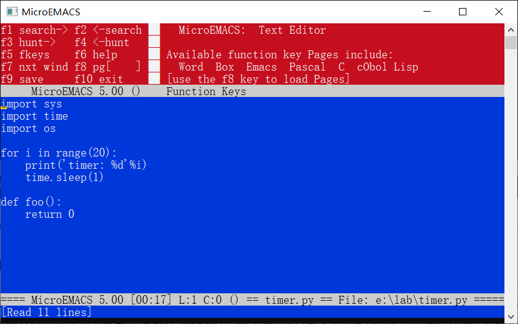
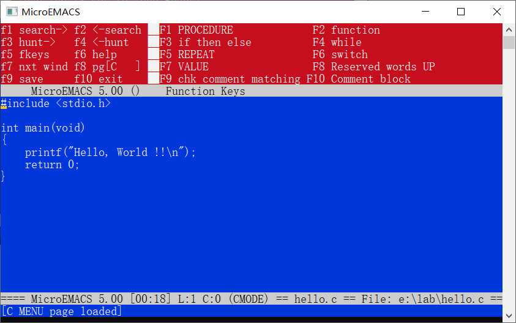

# MicroEMACS

[MicroEMACS](https://github.com/pmachapman/memacs) Editor by Daniel Lawrence.

## Preface

MicroEMACS is a tool for creating and changing documents, programs, and other text files. It is both relatively easy for the novice to use, but also very powerful in the hands of an expert. MicroEMACS can be extensively customized for the needs of the individual user.

MicroEMACS allows several files to be edited at the same time. The screen can be split into different windows and screens, and text may be moved freely from one window on any screen to the next. Depending on the type of file being edited, MicroEMACS can change how it behaves to make editing simple. Editing standard text files, program files and word processing documents are all possible at the same time.

## Screenshot

Start with `emacs.rc` and macros (`*.cmd` files) loaded:

Press `F8` can load languages specific help function (see the top-right window):

Press `F5` to hide the function window:

Clear `memacs.exe` startup (without any `emacs.rc` and macros):

If you put `memacs.exe` in an empty folder and run it, you can still have a standard MicroEMACS and edit without any configuration.

## History

The development of MicroEMACS by Mr Conroy stopped fairly early on but Steve Wilhite and George Jones made fixes in the latter half of the 80s when porting it to the Amiga and released their changes back to the public domain. Brian Straight wrote a MicroEMACS manual in 1987, and we ended up with a collection of patches in 1988 bundled with Straight's manual that was referred to as "Version 3". That same year Daniel M. Lawrence (1958 - 2010) started issuing patches that he named as 3.x branches.

## Copyright

> MicroEMACS version 5.00		Release Notes
> 		23-Jan-2009
> 
> (C) Copyright 1988-2009 by Daniel M. Lawrence
> MicroEMACS 5.0 can be copied and distributed freely for any
> non-commercial purposes. Commercial users may use MicroEMACS
> 5.0 inhouse. Shareware distributors may redistribute
> MicroEMACS 5.0 for media costs only. MicroEMACS 5.0 can only
> be incorporated into commercial software or resold with the
> permission of the current author.

## Credit

- https://github.com/pmachapman/memacs

