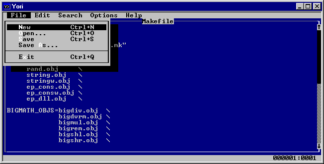

## YEdit

YEdit is a Win32/Win64 recreation of the MS-DOS 5 editor. It attempts to be faithful to the spirit of the original and can be copied as a single binary with no dependencies or installation. Since it is a Windows binary however, it also supports artbirary terminal sizes. It also supports different file type encodings, including UTF-8.

YEdit supports mouse input including the scroll wheel. Win32 mouse support in Windows Terminal requires version 1.10 or above.

`yedit` and `yhexedit` are parts of project [yori](http://www.malsmith.net/yori/).

## Credit

- https://github.com/malxau/yori
- http://www.malsmith.net/yori/

